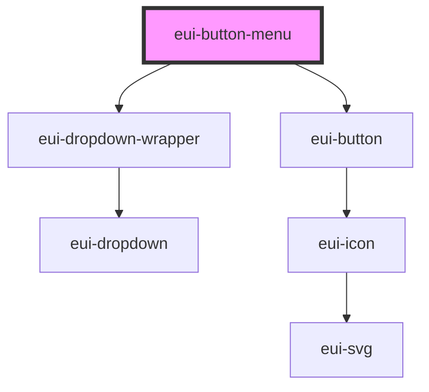

# eui-button-menu

<!-- Auto Generated Below -->

## Properties

| Property            | Attribute            | Description                                                        | Type                                           | Default         |
| ------------------- | -------------------- | ------------------------------------------------------------------ | ---------------------------------------------- | --------------- |
| `dropdownAlignment` | `dropdown-alignment` | sets the alignment of the dropdown                                 | `"left" \| "right"`                            | `'left'`        |
| `dropdownParent`    | --                   | sets the parent element for the eui-button-menu's dropdown         | `HTMLElement`                                  | `document.body` |
| `dropdownWidth`     | `dropdown-width`     | sets the width of the dropdown                                     | `number \| string`                             | `150`           |
| `isDropdownOpen`    | `is-dropdown-open`   | sets and reflects the state of the dropdown inside the button menu | `boolean`                                      | `false`         |
| `size`              | `size`               | sets the size of the eui-button-menu                               | `"large" \| "medium" \| "small"`               | `'small'`       |
| `text`              | `text`               | sets the label of the eui-button-menu                              | `string`                                       | `''`            |
| `type`              | `type`               | sets the styling of the eui-button-menu                            | `"brand" \| "outlined" \| "primary" \| "text"` | `'outlined'`    |

## Dependencies

### Depends on

- [eui-dropdown-wrapper](../dropdown-wrapper)
- [eui-button](../button)

### Graph

----------------------------------------------

*Built with [StencilJS](https://stenciljs.com/)*
