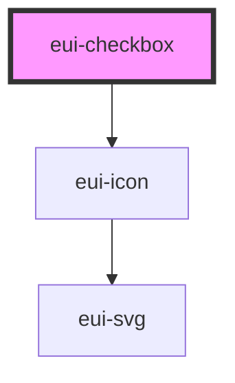

# eui-checkbox

<!-- Auto Generated Below -->

## Properties

| Property   | Attribute  | Description                                                                          | Type                             | Default     |
| ---------- | ---------- | ------------------------------------------------------------------------------------ | -------------------------------- | ----------- |
| `checked`  | `checked`  | sets and reflects the state of the checkbox partial counts as unchecked              | `boolean`                        | `false`     |
| `disabled` | `disabled` | disables the checkbox and the pointer events                                         | `boolean`                        | `undefined` |
| `error`    | `error`    | sets error design                                                                    | `boolean`                        | `undefined` |
| `label`    | `label`    | sets the label for the checkbox                                                      | `string`                         | `undefined` |
| `name`     | `name`     | sets the name attribute of the inner input                                           | `string`                         | `undefined` |
| `partial`  | `partial`  | sets the visual for the partial checkbox only unchecked inputs will shown as partial | `boolean`                        | `false`     |
| `size`     | `size`     | sets the size of the checkbox                                                        | `"large" \| "medium" \| "small"` | `'small'`   |

## Events

| Event     | Description                                                  | Type                   |
| --------- | ------------------------------------------------------------ | ---------------------- |
| `changed` | Custom change event only fires if the change happened inside | `CustomEvent<boolean>` |

## Dependencies

### Depends on

- [eui-icon](../icon)

### Graph

----------------------------------------------

*Built with [StencilJS](https://stenciljs.com/)*
