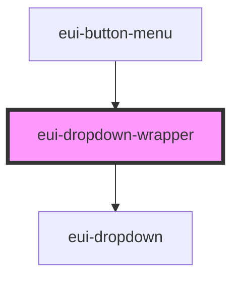

# eui-dropdown-wrapper

<!-- Auto Generated Below -->

## Properties

| Property            | Attribute            | Description                                              | Type                | Default         |
| ------------------- | -------------------- | -------------------------------------------------------- | ------------------- | --------------- |
| `dropdownAlignment` | `dropdown-alignment` | sets the alignment of the dropdown based on this element | `"left" \| "right"` | `'left'`        |
| `dropdownParent`    | --                   | sets the parent element for the dropdown                 | `HTMLElement`       | `document.body` |
| `dropdownWidth`     | `dropdown-width`     | sets the width of the dropdown                           | `number \| string`  | `150`           |
| `isDropdownOpen`    | `is-dropdown-open`   | sets and reflects the state of it's dropdown element     | `boolean`           | `false`         |

## Events

| Event                  | Description                                                   | Type                   |
| ---------------------- | ------------------------------------------------------------- | ---------------------- |
| `clicked`              | Triggers an event when the parent of  the dropdown is clicked | `CustomEvent<any>`     |
| `dropdownStateChanged` | Triggers an event after the dropdown state changed            | `CustomEvent<boolean>` |

## Dependencies

### Used by

 - [eui-button-menu](../button-menu)

### Depends on

- [eui-dropdown](../dropdown)

### Graph

----------------------------------------------

*Built with [StencilJS](https://stenciljs.com/)*
