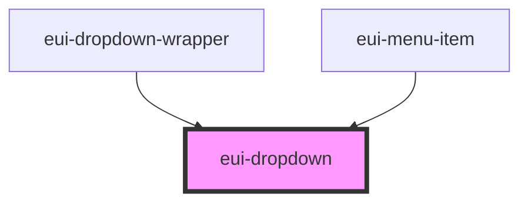

# eui-dropdown

<!-- Auto Generated Below -->

## Properties

| Property   | Attribute   | Description                                                                            | Type                                                                | Default   |
| ---------- | ----------- | -------------------------------------------------------------------------------------- | ------------------------------------------------------------------- | --------- |
| `isOpen`   | `is-open`   | sets and reflects the state of the dropdown                                            | `boolean`                                                           | `false`   |
| `openerId` | `opener-id` | sets and reflects the identifier of the opener                                         | `string`                                                            | `null`    |
| `position` | --          | sets the position of the dropdown                                                      | `{ top?: number; right?: number; bottom?: number; left?: number; }` | `{}`      |
| `size`     | `size`      | sets the size of the component can be 'small', 'medium' or 'large' defaults to 'small' | `"large" \| "medium" \| "small"`                                    | `'small'` |
| `width`    | `width`     | sets and reflects the width of the dropdown                                            | `string`                                                            | `null`    |

## Events

| Event             | Description                                           | Type                   |
| ----------------- | ----------------------------------------------------- | ---------------------- |
| `openStateChange` | Emits an event when the state of the dropdown changed | `CustomEvent<boolean>` |

## Dependencies

### Used by

 - [eui-dropdown-wrapper](../dropdown-wrapper)
 - [eui-menu-item](../menu-item)

### Graph

----------------------------------------------

*Built with [StencilJS](https://stenciljs.com/)*
