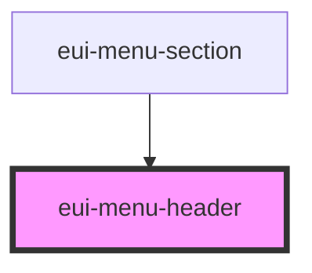

# eui-menu-header

<!-- Auto Generated Below -->

## Properties

| Property       | Attribute       | Description                                                                            | Type                             | Default   |
| -------------- | --------------- | -------------------------------------------------------------------------------------- | -------------------------------- | --------- |
| `indent`       | `indent`        | sets the level of indent                                                               | `number`                         | `0`       |
| `indentAmount` | `indent-amount` | the amount by which each level is indented to the previous level                       | `number`                         | `12`      |
| `size`         | `size`          | sets the size of the component can be 'small', 'medium' or 'large' defaults to 'small' | `"large" \| "medium" \| "small"` | `'small'` |

## Dependencies

### Used by

 - [eui-menu-section](../menu-section)

### Graph

----------------------------------------------

*Built with [StencilJS](https://stenciljs.com/)*
