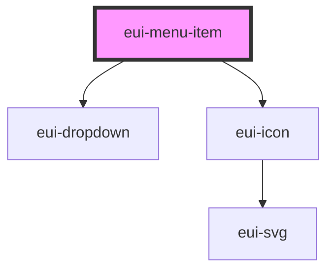

# eui-menu-item

<!-- Auto Generated Below -->

## Properties

| Property         | Attribute          | Description                                                                                                                                                                                                                                                                                                                                                            | Type                                        | Default         |
| ---------------- | ------------------ | ---------------------------------------------------------------------------------------------------------------------------------------------------------------------------------------------------------------------------------------------------------------------------------------------------------------------------------------------------------------------- | ------------------------------------------- | --------------- |
| `checked`        | `checked`          | adds checked design to the component                                                                                                                                                                                                                                                                                                                                   | `boolean`                                   | `false`         |
| `disabled`       | `disabled`         | adds disabled design to the component prevents mouse click events and the opening of the dropdown                                                                                                                                                                                                                                                                      | `boolean`                                   | `false`         |
| `dropdownParent` | --                 | sets the element to which the dropdown should be appended if present                                                                                                                                                                                                                                                                                                   | `HTMLElement`                               | `document.body` |
| `dropdownWidth`  | `dropdown-width`   | sets the width of the dropdown if present                                                                                                                                                                                                                                                                                                                              | `number`                                    | `150`           |
| `indent`         | `indent`           | sets the level of indent                                                                                                                                                                                                                                                                                                                                               | `number`                                    | `0`             |
| `indentAmount`   | `indent-amount`    | the amount by which each level is indented to the previous level                                                                                                                                                                                                                                                                                                       | `number`                                    | `12`            |
| `isDropdownOpen` | `is-dropdown-open` | sets the open state of the dropdown of the component                                                                                                                                                                                                                                                                                                                   | `boolean`                                   | `false`         |
| `itemLabel`      | `item-label`       | label that is to be displayed in the item                                                                                                                                                                                                                                                                                                                              | `string`                                    | `''`            |
| `linePosition`   | `line-position`    | sets the position of selected line                                                                                                                                                                                                                                                                                                                                     | `"bottom" \| "left" \| "right" \| "top"`    | `'left'`        |
| `nestAlignment`  | `nest-alignment`   | sets the alignment of the dropdown                                                                                                                                                                                                                                                                                                                                     | `"center" \| "end" \| "start"`              | `'start'`       |
| `nestPosition`   | `nest-position`    | sets the position of the dropdown                                                                                                                                                                                                                                                                                                                                      | `"bottom" \| "left" \| "right" \| "top"`    | `'bottom'`      |
| `selected`       | `selected`         | adds selected design to the component                                                                                                                                                                                                                                                                                                                                  | `boolean`                                   | `false`         |
| `size`           | `size`             | sets the size of the component can be 'small', 'medium' or 'large' defaults to 'small'                                                                                                                                                                                                                                                                                 | `"large" \| "medium" \| "small"`            | `'small'`       |
| `type`           | `type`             | sets the type of component if type is 'default' the component has no dropdown if type is 'click' the component has dropdown and it opens when the component is clicked if type is 'hover' the component has dropdown and it opens when the component is hovered if type is 'icon' the component has dropdown and it opens when the chevron in the component is clicked | `"click" \| "default" \| "hover" \| "icon"` | `'default'`     |
| `uuid`           | `uuid`             | unique id of the menu item                                                                                                                                                                                                                                                                                                                                             | `string`                                    | `uuid.v4()`     |

## Events

| Event                 | Description                               | Type                   |
| --------------------- | ----------------------------------------- | ---------------------- |
| `closeDropdown`       | emitted when dropdown is closed           | `CustomEvent<string>`  |
| `dropdownStateChange` | emitted when dropdown is opened or closed | `CustomEvent<boolean>` |

## Dependencies

### Depends on

- [eui-dropdown](../dropdown)
- [eui-icon](../icon)

### Graph

----------------------------------------------

*Built with [StencilJS](https://stenciljs.com/)*
