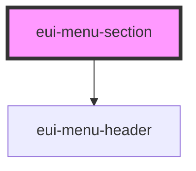

# eui-menu-section

<!-- Auto Generated Below -->

## Properties

| Property           | Attribute            | Description                        | Type      | Default     |
| ------------------ | -------------------- | ---------------------------------- | --------- | ----------- |
| `collapsible`      | `collapsible`        | makes the menu section collapsible | `boolean` | `undefined` |
| `menuHeaderIndent` | `menu-header-indent` | sets the indent for the menu item  | `number`  | `undefined` |
| `sectionTitle`     | `section-title`      | sets the title of the section      | `string`  | `undefined` |

## Events

| Event             | Description                                           | Type                   |
| ----------------- | ----------------------------------------------------- | ---------------------- |
| `collapseToggled` | emits an event after the state of the collapse change | `CustomEvent<boolean>` |

## Dependencies

### Depends on

- [eui-menu-header](../menu-header)

### Graph

----------------------------------------------

*Built with [StencilJS](https://stenciljs.com/)*
