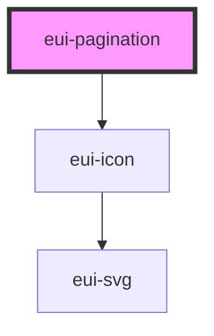

# eui-pagination

<!-- Auto Generated Below -->

## Properties

| Property      | Attribute      | Description                                                                            | Type                             | Default   |
| ------------- | -------------- | -------------------------------------------------------------------------------------- | -------------------------------- | --------- |
| `currentPage` | `current-page` | sets the current page                                                                  | `number`                         | `1`       |
| `pages`       | `pages`        | sets the number of pages                                                               | `number`                         | `1`       |
| `size`        | `size`         | sets the size of the component can be 'small', 'medium' or 'large' defaults to 'small' | `"large" \| "medium" \| "small"` | `'small'` |

## Events

| Event                | Description                                                 | Type                  |
| -------------------- | ----------------------------------------------------------- | --------------------- |
| `selectedPageChange` | Emits the page number after a navigation chevron is clicked | `CustomEvent<number>` |

## Dependencies

### Depends on

- [eui-icon](../icon)

### Graph

----------------------------------------------

*Built with [StencilJS](https://stenciljs.com/)*
