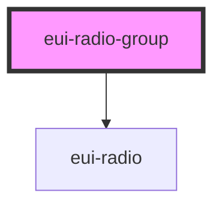

# eui-radio-group

<!-- Auto Generated Below -->

## Properties

| Property | Attribute | Description                                              | Type                           | Default     |
| -------- | --------- | -------------------------------------------------------- | ------------------------------ | ----------- |
| `name`   | `name`    | sets the name of the inner radios                        | `string`                       | `undefined` |
| `value`  | `value`   | sets and reflects the selected value of the inner radios | `number \| string \| string[]` | `undefined` |
| `values` | --        | sets values and label and availability of the radios     | `RadioGroupValue[]`            | `[]`        |

## Events

| Event                 | Description                                                         | Type                                                                  |
| --------------------- | ------------------------------------------------------------------- | --------------------------------------------------------------------- |
| `euiRadioGroupChange` | emits an event when a radio button with the same name changed in it | `CustomEvent<{ name: string; value: string \| number \| string[]; }>` |

## Dependencies

### Depends on

- [eui-radio](../radio)

### Graph

----------------------------------------------

*Built with [StencilJS](https://stenciljs.com/)*
