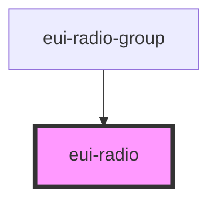

# eui-radio

<!-- Auto Generated Below -->

## Properties

| Property   | Attribute  | Description                                                                            | Type                             | Default     |
| ---------- | ---------- | -------------------------------------------------------------------------------------- | -------------------------------- | ----------- |
| `checked`  | `checked`  | sets and reflects the state of the radio element                                       | `boolean`                        | `false`     |
| `disabled` | `disabled` | disable the radio element                                                              | `boolean`                        | `false`     |
| `label`    | `label`    | sets the label of the inner radio input                                                | `string`                         | `undefined` |
| `name`     | `name`     | sets the name of the inner radio input                                                 | `string`                         | `undefined` |
| `size`     | `size`     | sets the size of the component can be 'small', 'medium' or 'large' defaults to 'small' | `"large" \| "medium" \| "small"` | `'small'`   |
| `value`    | `value`    | sets the value of the inner radio input                                                | `number \| string \| string[]`   | `undefined` |

## Events

| Event            | Description                          | Type                                                                  |
| ---------------- | ------------------------------------ | --------------------------------------------------------------------- |
| `euiRadioChange` | emits the state of the radio element | `CustomEvent<{ name: string; value: string \| number \| string[]; }>` |

## Dependencies

### Used by

 - [eui-radio-group](../radio-group)

### Graph

----------------------------------------------

*Built with [StencilJS](https://stenciljs.com/)*
