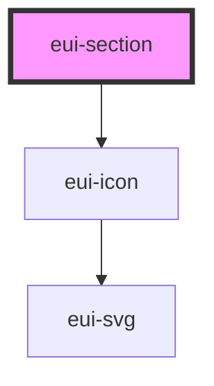

# eui-section

<!-- Auto Generated Below -->

## Properties

| Property             | Attribute      | Description                                                        | Type                             | Default     |
| -------------------- | -------------- | ------------------------------------------------------------------ | -------------------------------- | ----------- |
| `collapsed`          | `collapsed`    | if the collapsible is set to true stores the state of the collapse | `boolean`                        | `undefined` |
| `collapsible`        | `collapsible`  | if set to true a click on the header collapses the body            | `boolean`                        | `undefined` |
| `headerStyle`        | `header-style` | changes the background color of the header                         | `"dark" \| "light"`              | `'light'`   |
| `label` _(required)_ | `label`        | sets the label of the section required                             | `string`                         | `undefined` |
| `size`               | `size`         | changes the size related styles of the component                   | `"large" \| "medium" \| "small"` | `'small'`   |

## Dependencies

### Depends on

- [eui-icon](../icon)

### Graph

----------------------------------------------

*Built with [StencilJS](https://stenciljs.com/)*
