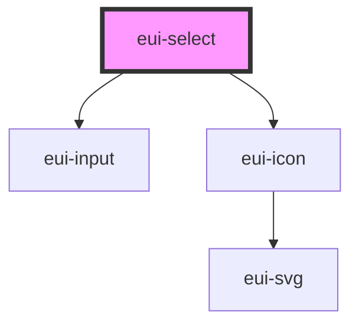

# eui-select

<!-- Auto Generated Below -->

## Properties

| Property               | Attribute                | Description                                                                                   | Type                                                                    | Default                    |
| ---------------------- | ------------------------ | --------------------------------------------------------------------------------------------- | ----------------------------------------------------------------------- | -------------------------- |
| `cancelText`           | `cancel-text`            | The text to display on the cancel button.                                                     | `string`                                                                | `'Cancel'`                 |
| `clearErrorOnFocus`    | `clear-error-on-focus`   | If set true clears error state on the input when focused                                      | `boolean`                                                               | `true`                     |
| `compareWith`          | `compare-with`           | A property name or function used to compare object values                                     | `((currentValue: unknown, compareValue: unknown) => boolean) \| string` | `undefined`                |
| `disabled`             | `disabled`               | If `true`, the user cannot interact with the select.                                          | `boolean`                                                               | `false`                    |
| `dropdownParent`       | --                       | sets the parent of the dropdown                                                               | `HTMLElement`                                                           | `document.body`            |
| `dropdownPosition`     | `dropdown-position`      | position of the select dropdown component if set 'absolute' dropdown appears next to dropdown | `"absolute" \| "fixed"`                                                 | `'absolute'`               |
| `error`                | `error`                  | if set true it enables error state for the select                                             | `boolean`                                                               | `undefined`                |
| `hasFocus`             | `has-focus`              | focus state of the component                                                                  | `boolean`                                                               | `false`                    |
| `isField`              | `is-field`               | True if input is part of an eui-field                                                         | `boolean`                                                               | `false`                    |
| `multiple`             | `multiple`               | If `true`, the select can accept multiple values.                                             | `boolean`                                                               | `false`                    |
| `name`                 | `name`                   | The name of the control, which is submitted with the form data.                               | `string`                                                                | ``eui-sel-${selectIds++}`` |
| `okText`               | `ok-text`                | The text to display on the ok button.                                                         | `string`                                                                | `'OK'`                     |
| `options`              | --                       | If `true`, the user cannot interact with the select.                                          | `SelectOptionInterface[]`                                               | `null`                     |
| `placeholder`          | `placeholder`            | The text to display when the select is empty.                                                 | `string`                                                                | `undefined`                |
| `readonly`             | `readonly`               | If `true`, the user cannot modify the value.                                                  | `boolean`                                                               | `false`                    |
| `selectedText`         | `selected-text`          | The text to display instead of the selected option's value.                                   | `string`                                                                | `undefined`                |
| `size`                 | `size`                   | Sets the size styles of the select component                                                  | `"large" \| "medium" \| "small"`                                        | `'small'`                  |
| `value`                | --                       | the value of the select.                                                                      | `EuiOptionInterface \| EuiOptionInterface[]`                            | `undefined`                |
| `valueDisplayPosition` | `value-display-position` | If `true`, the user cannot interact with the select.                                          | `"inside" \| "under"`                                                   | `'inside'`                 |

## Events

| Event       | Description                              | Type                                   |
| ----------- | ---------------------------------------- | -------------------------------------- |
| `euiBlur`   | Emitted when the select loses focus.     | `CustomEvent<void>`                    |
| `euiCancel` | Emitted when the selection is cancelled. | `CustomEvent<void>`                    |
| `euiChange` | Emitted when the value has changed.      | `CustomEvent<SelectChangeEventDetail>` |
| `euiFocus`  | Emitted when the select has focus.       | `CustomEvent<void>`                    |

## Methods

### `open() => Promise<HTMLEuiSelectDropdownElement>`

Open the select overlay. The overlay is either an alert, action sheet, or popover,
depending on the `interface` property on the `eui-select`.

#### Returns

Type: `Promise<HTMLEuiSelectDropdownElement>`

### `updateDropdownPosition() => Promise<void>`

Updates the dropdown position

#### Returns

Type: `Promise<void>`

[object Object]

## CSS Custom Properties

| Name                    | Description                                                                                               |
| ----------------------- | --------------------------------------------------------------------------------------------------------- |
| `--padding-bottom`      | Bottom padding of the select                                                                              |
| `--padding-end`         | Right padding if direction is left-to-right, and left padding if direction is right-to-left of the select |
| `--padding-start`       | Left padding if direction is left-to-right, and right padding if direction is right-to-left of the select |
| `--padding-top`         | Top padding of the select                                                                                 |
| `--placeholder-color`   | Color of the select placeholder text                                                                      |
| `--placeholder-opacity` | Opacity of the select placeholder text                                                                    |

## Dependencies

### Depends on

- [eui-input](../input)
- [eui-icon](../icon)

### Graph

----------------------------------------------

*Built with [StencilJS](https://stenciljs.com/)*
