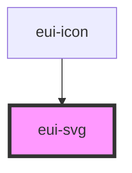

# eui-svg

<!-- Auto Generated Below -->

## Properties

| Property  | Attribute | Description                          | Type     | Default     |
| --------- | --------- | ------------------------------------ | -------- | ----------- |
| `content` | `content` | content                              | `string` | `undefined` |
| `src`     | `src`     | src of the svg that is to be fetched | `string` | `''`        |

## Dependencies

### Used by

 - [eui-icon](../icon)

### Graph

----------------------------------------------

*Built with [StencilJS](https://stenciljs.com/)*
